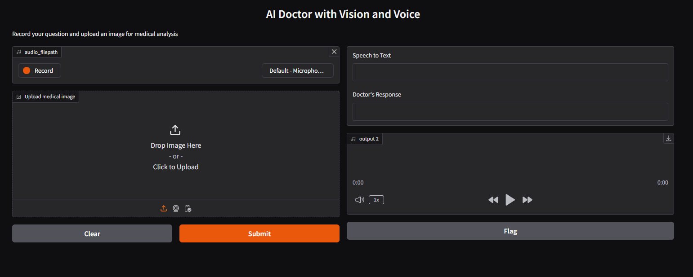
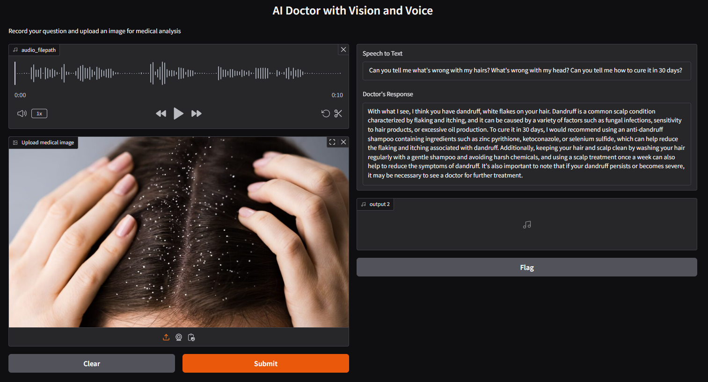

### Multimodal Medical Chatbot using Groq

A multimodal medical chatbot that takes an audio recording and an image as input, processes them using AI, and provides an audio-based medical response.

* * * * *

### 🚀 Features

-   **Voice-Based Interaction** -- Users can ask medical queries through voice recordings.

-   **Image Analysis** -- Upload medical images for AI-based analysis.

-   **AI-Powered Medical Insights** -- Provides a concise, professional medical response as if from a real doctor.

-   **Text-to-Speech Output** -- Generates an audio response using ElevenLabs or Google Text-to-Speech.

-   **Seamless User Experience** -- Integrated with a Gradio-based UI for easy interaction.

* * * * *

## Tech Stack 🛠️

| Component              | Technology                          |
|------------------------|-------------------------------------|
| **AI Inference**       | Groq API                            |
| **Vision Model**       | LLaMA-3 90B Vision Preview          |
| **Speech Recognition** | Whisper Large v3                    |
| **Text-to-Speech**     | ElevenLabs OR gTTS                   |
| **Web Interface**      | Gradio                              |
| **Audio Processing**   | PyAudio, pydub                      |

* * * * *

### 🛠️ Installation

#### 1️⃣ Clone the Repository

```bash
git clone https://github.com/Raza-Aziz/Multimodal-Medical-Chatbot-using-Groq.git
cd Multimodal-Medical-Chatbot-using-Groq
```

#### 2️⃣ Set Up a Virtual Environment

```bash
conda create --name medibot python=3.11
conda activate medibot
```

#### 3️⃣ Install Dependencies

All required dependencies are listed in `requirements.txt`. Install them with:

```bash
pip install -r requirements.txt
```

#### 4️⃣ Configure API Keys

Create a `.env` file in the root directory and add your Groq and ElevenLabs credentials:

```bash
GROQ_API_KEY="your_groq_api_key"
ELEVENLABS_API_KEY="your_elevenlabs_api_key"
```

* * * * *

### 📌 Usage

#### 1️⃣ Run the Chatbot Application

```
python gradio_app.py
```

#### 2️⃣ Access the User Interface

Open your web browser and go to:\
[http://localhost:7860](http://localhost:7860/)

#### 3️⃣ Interaction Process

-   **Record a voice query or upload an audio file.**

-   **Upload a medical image.**

-   **The AI analyzes both inputs and generates a professional medical response.**

-   **The response is provided as both text and synthesized speech.**

* * * * *

### 🧐 How It Works

1️⃣ **Audio Processing:**

-   The patient's voice is recorded via Gradio or uploaded as an MP3 file.

-   The speech-to-text model (Whisper v3 via Groq) transcribes the query.

2️⃣ **Image Analysis:**

-   The uploaded medical image is encoded in base64 format.

-   It is analyzed using Groq's multimodal model (LLaMA 3.2 Vision).

3️⃣ **AI-Generated Medical Response:**

-   The transcribed text and image data are passed to the LLaMA model.

-   The AI provides a medical assessment and suggested remedies.

4️⃣ **Text-to-Speech Conversion:**

-   The AI-generated response is converted into speech using ElevenLabs.

-   The synthesized audio is played back to the user.

* * * * *

### 🖼️ Screenshots

| Feature | Screenshot |
| --- | --- |
| Chat Interface |  |
| Image Analysis Example |  |

* * * * *

### 📄 License

This project is licensed under the **MIT License** -- see the `LICENSE` file for details.

* * * * *

### 👨‍💻 Contact

For any questions or contributions, feel free to reach out:\
**GitHub:** [@Raza-Aziz](https://github.com/Raza-Aziz)\
**Email:** <razaaziz9191@gmail.com>